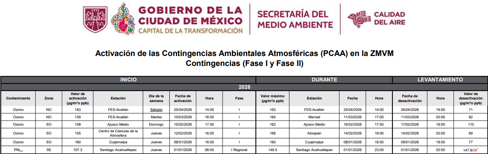
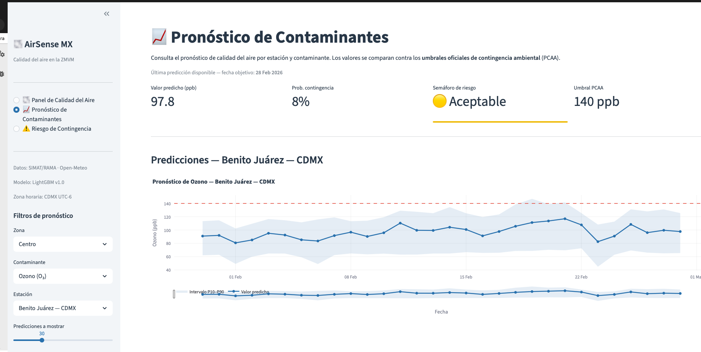
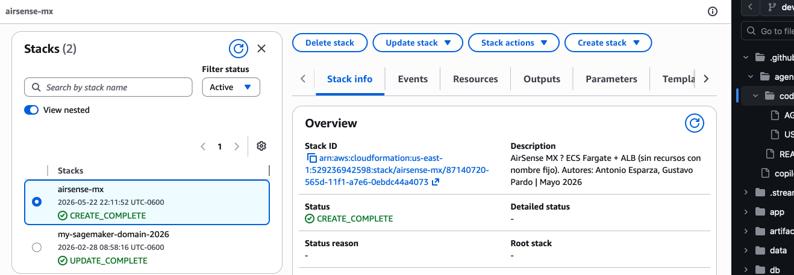
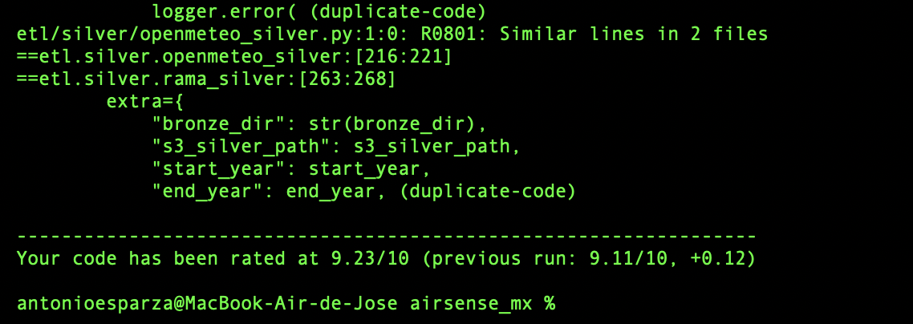

# AirSense MX
**Predicción de calidad del aire**

> Proyecto final Maestría Data Science ITAM | Mayo 2026 | 35% de la nota final

**Autores:** José Antonio Esparza · Gustavo Pardo  
**Repositorio:** https://github.com/gustavopardoitam/airsense_mx

**App en producción:** http://airsense-ALB-YiHrCXbdlbCe-2095125925.us-east-1.elb.amazonaws.com

---

## Descripción Ejecutiva

AirSense MX es un sistema de predicción probabilística de contaminantes atmosféricos (O₃, PM₂.₅, PM₁₀) para la Zona Metropolitana del Valle de México, diseñado para anticipar episodios de contingencia ambiental y facilitar decisiones de salud pública.

**Componentes clave:**
- **Ingesta**: 40+ estaciones SIMAT/RAMA (histórico 2015–2024) + 5 centroides meteorológicos Open-Meteo
- **Predicción**: LightGBM con features meteorológicos y lag autorregresivos (horizonte 1–7 días)
- **Exposición**: Dashboard Streamlit + API Bedrock Haiku para explicaciones NLP
- **Infraestructura**: AWS (S3, Glue, Athena, SageMaker, EC2 t3.small)

---

## Problema de Negocio

La contaminación atmosférica en la ZMVM causa ~13,000 muertes prematuras anuales (OMS). Las contingencias ambientales se declaran reactivamente, *después* de que la contaminación ya es crítica.

**Solución:** Predicciones horarias 7 días adelante, por zona, con explicaciones contextuales.

---

## Usuario Final

1. **Personas vulnerables** (asma, EPOC): Planificar actividades al aire libre
2. **Corredores/deportistas**: Alertas de calidad antes de entrenamientos
3. **Padres de familia**: Decisiones sobre transporte y actividades escolares
4. **Tomadores de decisión** (SEDEMA, PROAIRE): Anticipar contingencias; optimizar medidas de restricción vehicular

---

## Arquitectura del Producto

### Flujo de datos (Medallion Architecture)

```
┌─────────────────────────────────────────────────────────────┐
│ FUENTES                                                     │
├─────────────────────────────────────────────────────────────┤
│ SIMAT/RAMA                 Open-Meteo            PCAA       │
│ (Excel wide, 2015-2024)    (API archive, 2020+) (validación)│
└────────────┬──────────────────┬──────────────────┬──────────┘
             │                  │                  │
             ▼                  ▼                  ▼
┌────────────────────────────────────────────────────────────┐
│ BRONZE                                                     │
│ (Raw JSON/Parquet particionado)                            │
│ s3://airsense-mx/bronze/                                   │
│ ├─ simat/station_id=XXX/year=YYYY/                         │
│ └─ open_meteo/zone=ZZ/year=YYYY/                           │
└────────────────────────┬─────────────────────────────────--┘
                         │
                         ▼
┌────────────────────────────────────────────────────────────┐
│ SILVER                                                     │
│ (Normalizado, timestamps UTC-6, long format)               │
│ s3://airsense-mx/silver/                                   │
│ ├─ contaminantes_horario/ (O3, PM2.5, PM10, NO2, SO2)      │
│ └─ meteo_horario/ (temp, humedad, presión, viento, etc)    │
└────────────────────────┬─────────────────────────────────--┘
                         │
                         ▼
┌───────────────────────────────────────────────────────────┐
│ GOLD                                                      │
│ (Features + predicciones batch)                           │
│ s3://airsense-mx/gold/                                    │
│ ├─ features_1h/                                           │
│ ├─ predicciones_batch/                                    │
│ └─ shap_explanations/                                     │
└────────────────────────┬─────────────────────────────────-┘
                         │
                         ▼
┌────────────────────────────────────────────────────────────┐
│ APLICACIÓN (Streamlit + Bedrock)                           │
│ ec2-t3-small.compute.amazonaws.com:8501                    │
└────────────────────────────────────────────────────────────┘
```

---

## Stack Tecnológico

| Capa | Herramientas |
|------|-------------|
| **Data** | pandas, pyarrow, awswrangler, sqlalchemy |
| **ML** | lightgbm, scikit-learn, joblib, shap |
| **App** | streamlit, requests, boto3 |
| **Cloud** | AWS S3, Glue, Athena, SageMaker, Bedrock, ECS Fargate, ALB, ECR |
| **DevOps** | Docker, uv (Python 3.11), pytest, ruff |
| **Config** | YAML, pathlib, frozen dataclasses |

---

## Estructura del Repositorio

```
airsense_mx/
├── README.md                          # este archivo
├── pyproject.toml                     # dependencias uv (determinísticas)
├── uv.lock                            # lock file
├── .github/
│   └── copilot-instructions.md        # estándares de código
├── config.py                          # configuración centralizada (Paths, Thresholds)
├── data/
│   ├── dim_estaciones.csv             # catálogo de estaciones SIMAT (40+)
│   ├── raw/
│   │   ├── openmeteo/                 # Bronze JSON raw
│   │   │   └── station_id=BJU/year=2023/openmeteo_BJU_2023.json
│   │   └── simat/                     # SIMAT Excel
│   ├── processed/                     # Silver parquet
│   └── models/                        # artifacts locales
├── etl/
│   ├── __init__.py
│   ├── __main__.py                    # orchestrator principal
│   ├── openmeteo_bronze.py            # Bronze: ingesta Open-Meteo (por estación/año)
│   ├── bronze.py                      # Bronze: ingesta SIMAT
│   ├── silver.py                      # Silver: normalización, denormalizaciones
│   ├── gold.py                        # Gold: features para ML
│   ├── features.py                    # feature engineering
│   └── test/
│       ├── test_openmeteo_bronze.py   # unit tests, mocks totales
│       ├── test_bronze_open_meteo.py  # legacy tests
│       └── test_prep.py
├── training/
│   ├── __init__.py
│   ├── __main__.py
│   └── train.py                       # LightGBM, temporal split
├── inference/
│   ├── __init__.py
│   ├── __main__.py
│   └── predict.py                     # batch predictions
├── evaluation/
│   ├── __init__.py
│   ├── __main__.py
│   └── evaluate.py                    # validación vs PCAA, SHAP
├── app/
│   ├── main.py                        # entry point Streamlit
│   ├── views/                         # páginas: dashboard, pronostico, contingencias
│   ├── components/                    # badges, cards, charts
│   ├── data/                          # s3_loader
│   └── models/                        # risk_analyzer, bedrock_explainer
├── utils/
│   ├── logging.py                     # setup centralizado
│   ├── exceptions.py                  # excepciones del dominio
│   └── __init__.py
├── tests/
│   ├── test_smoke.py                  # E2E mínimo
│   └── __init__.py
├── infra/
│   ├── README.md                      # documentación infraestructura
│   └── core.yaml                      # CloudFormation template (ECS Fargate, ALB, IAM, CloudWatch)
└── docs/
    ├── arquitectura.md                # arquitectura del sistema (simplificada)
    ├── arquitectura.drawio            # diagrama visual (5 capas, top-down)
    ├── datasets/                      # data contracts YAML
    └── datasets/
```

---

## Flujo Medallion

### Bronze: Raw → Structured

**Propósito**: Ingesta cruda, cero transformaciones, máxima trazabilidad.

**Características:**
- Datos particionados por `station_id=XXX/year=YYYY/`
- JSON raw para SIMAT/Open-Meteo, Parquet para validación PCAA
- Metadata envelope: `_metadata` con timestamps, URLs, coordenadas originales vs. snapped
- Idempotente: verifica existencia en S3 antes de sobrescribir

**Ejecución:**
```bash
# RAMA/SIMAT (Excel histórico de contaminantes 2021-presente)
uv run python -m etl.rama_bronze \
  --output-dir data/raw/rama \
  --start-year 2021 \
  --pollutants O3 PM25 PM10 NO2 SO2 CO

# Open-Meteo (JSON meteorológico por estación 2021-presente)
uv run python -m etl.openmeteo_bronze \
  --stations-path data/dim_estaciones.csv \
  --output-dir data/raw/openmeteo \
  --start-year 2021
```

### Silver: Estructura → Semantics

**Propósito**: Normalización, denormalizaciones, validación de NULL.

**Transformaciones:**
- Timestamps UTC-6 consistentes (sin DST)
- Long format: `station_id`, `zone`, `timestamp`, `contaminante`, `valor`
- Denormalización con `dim_estaciones` (lat/lon, municipio, altitud)
- NULL nativo (nunca -99, NaN string, -1)
- Outliers marcados pero conservados (auditoria)

### Gold: Features → Predictions

**Propósito**: Features ML-ready, predicciones batch, explicaciones.

**Artefactos:**
- Features: lags (6h, 12h, 24h, 48h, 72h), rolling means (12h, 24h)
- Predicciones: `timestamp_prediccion`, `estacion`, `horizon_horas`, `contaminante`, `pred_mean`, `pred_p5`, `pred_p95`
- SHAP values: contribuciones por feature para top-10 features

---

## Ingesta Open-Meteo: Cómo Funciona

### Por Qué Open-Meteo

Open-Meteo provee datos meteorológicos horarios históricos (libre de costos, sin key):
- Cobertura global, grilla ECMWF 9km (~40 km² por celda)
- Variables: temperatura, humedad, presión, viento, radiación, precipitación
- Laguna histórica: 2021-presente
- Complementa SIMAT (que mide contaminantes, no meteorología directa)

### Catálogo de Estaciones: `dim_estaciones.csv`

Central de referencia que vincula estaciones SIMAT con coordenadas:

```
station_id,latitude,longitude,zone,is_active,station_name,municipality
BJU,19.3705,-99.1596,CE,TRUE,Benito Juárez,Benito Juárez
XAL,19.5300,-99.0700,NE,TRUE,Xalostoc,Ecatepec
FES,19.3270,-99.1800,SO,TRUE,FES Acatlán,Cuajimalpa
...
```

**Lógica:**
1. Lee CSV, filtra `is_active = TRUE`
2. Para cada estación + cada año (2021-2026):
   - Extrae `latitude`, `longitude` del CSV
   - Construye llamada Open-Meteo: `https://archive-api.open-meteo.com/v1/archive?latitude=...&longitude=...&start_date=2023-01-01&end_date=2023-12-31&hourly=temperature_2m,humidity_2m,...`
   - Guarda respuesta JSON en: `data/raw/openmeteo/station_id=BJU/year=2023/openmeteo_BJU_2023.json`

### Detalles Técnicos

**Coordenadas: Solicitadas vs. Reales**

Open-Meteo usa grilla ECMWF de 9km. Cuando solicitas (19.3705, -99.1596), se snappea al punto más cercano, p.ej. (19.37, -99.16). Ambas se preservan en metadata:

```json
{
  "_metadata": {
    "_ingested_at": "2025-05-22T14:32:10Z",
    "_zone": "CE",
    "_year": 2023,
    "_latitude_requested": 19.3705,
    "_longitude_requested": -99.1596,
    "_latitude_actual": 19.37,    // snap
    "_longitude_actual": -99.16    // snap
  },
  "latitude": 19.37,
  "longitude": -99.16,
  "hourly": {
    "time": ["2023-01-01T00:00", "2023-01-01T01:00", ...],
    "temperature_2m": [15.2, 14.8, ...]
  }
}
```

**Idempotencia**

Si `data/raw/openmeteo/station_id=BJU/year=2023/openmeteo_BJU_2023.json` ya existe:
- Por defecto: **salta** la descarga (estatus: "skipped")
- Con flag `--overwrite`: descarga nuevamente

Seguro ejecutar múltiples veces sin duplicar datos.

**Variables descargadas**

```python
HOURLY_VARIABLES = [
    "temperature_2m",              # °C
    "relative_humidity_2m",        # %
    "dewpoint_2m",                 # °C
    "surface_pressure",            # hPa
    "precipitation",               # mm
    "cloud_cover",                 # %
    "shortwave_radiation",         # W/m²
    "wind_speed_10m",              # m/s
    "wind_direction_10m",          # °
    "wind_gusts_10m",              # m/s
]
```

---

## Cómo Correr Localmente

### Requisitos

- **macOS/Linux** (se testing en macOS 13.6+)
- **Python 3.11** (recomendado vía `pyenv`)
- **uv** (gestor de dependencias determinístico)
- **AWS credentials** (`~/.aws/credentials` con permisos S3) — **solo para ETL a cloud**

### Setup Inicial

```bash
# 1. Clonar
git clone https://github.com/gustavopardoitam/airsense_mx.git
cd airsense_mx

# 2. Instalar dependencias (determinísticas vía uv.lock)
uv sync

# 3. Verificar setup
uv run python --version
uv run which python
```

### Verificación del Ambiente

```bash
# Tests unitarios (debe pasar)
uv run pytest tests/ etl/test/ --cov=etl --cov=utils -v

# Lint
uv run ruff check . && uv run ruff format .

# Type hints (si tienes pyright instalado)
uv run pyright config.py etl/
```

---

## Cómo Correr el ETL Open-Meteo

Descarga datos meteorológicos de Open-Meteo para todas las estaciones activas:

```bash
uv run python -m etl.openmeteo_bronze \
  --stations-path data/dim_estaciones.csv \
  --output-dir data/raw/openmeteo \
  --start-year 2021
```

**Output esperado:**
```
✓ Descargadas estaciones × años = JSON files
✓ Ubicados en data/raw/openmeteo/station_id=*/year=*/
✓ Metadata incluye coordenadas solicitadas y snap grid ECMWF
✓ Idempotencia: re-ejecutar no duplica datos (skip)
```

---

## Estructura Esperada de Salida

### Local (disk)

```
data/raw/openmeteo/
├── station_id=BJU/
│   ├── year=2021/
│   │   └── openmeteo_BJU_2021.json      (~450 KB, 8760 filas)
│   ├── year=2022/
│   │   └── openmeteo_BJU_2022.json
│   └── year=2023/
│       └── openmeteo_BJU_2023.json
├── station_id=XAL/
│   ├── year=2021/
│   │   └── openmeteo_XAL_2021.json
│   └── ...
└── ...
```

---

## Cómo Correr Silver ETL (Normalización)

La capa Silver transforma datos Bronze (Excel RAMA/SIMAT + JSON Open-Meteo) en Parquet normalizado, con timestamps UTC-6 consistentes, tipos explícitos y validación de calidad.

### Ejecutar Silver ETL (2021–2026)

**1. RAMA/SIMAT (Excel → Long-format Parquet):**

```bash
uv run python -m etl.silver rama --start-year 2021 --end-year 2026 --overwrite
```

**2. Open-Meteo (JSON → Tabular Parquet):**

```bash
uv run python -m etl.silver openmeteo --start-year 2021 --end-year 2026 --overwrite
```

**Ambas en paralelo (recomendado):**

```bash
uv run python -m etl.silver rama --start-year 2021 --end-year 2026 --overwrite && \
uv run python -m etl.silver openmeteo --start-year 2021 --end-year 2026 --overwrite
```

### Output Esperado

```
data/prep/silver/
├── observaciones_horarias/          # RAMA/SIMAT limpio
│   ├── year=2021/month=01/*.parquet
│   ├── year=2021/month=02/*.parquet
│   └── ... (year=2021 a year=2026)
└── meteo_horario/                   # Open-Meteo normalizado
    ├── year=2021/month=01/*.parquet
    ├── year=2021/month=02/*.parquet
    └── ... (year=2021 a year=2026)
```

### Parámetros Disponibles

| Parámetro | Tipo | Default | Descripción |
|---|---|---|---|
| `--start-year` | int | 2021 | Primer año a procesar |
| `--end-year` | int | 2026 | Último año (inclusive) |
| `--bronze-dir` | Path | auto | Ruta datos Bronze |
| `--silver-dir` | Path | auto | Ruta salida Silver |
| `--dim-path` | Path | auto | Ruta `dim_estaciones.csv` |
| `--station-id` | str | None | (Open-Meteo) Filtrar estación única |
| `--overwrite` | flag | False | Sobrescribir si existe |

### Ejemplo: Test Rápido (2023 solamente)

```bash
# Test rápido RAMA
uv run python -m etl.silver rama --start-year 2023 --end-year 2023 --overwrite

# Test rápido Open-Meteo (una estación)
uv run python -m etl.silver openmeteo --start-year 2023 --end-year 2023 --station-id BJU --overwrite
```

### Verificar Output

```bash
# Listar archivos generados
ls -lh data/prep/silver/observaciones_horarias/year=2021/month=01/
ls -lh data/prep/silver/meteo_horario/year=2021/month=01/

# Leer sample (primeras 5 filas)
python -c "
import pandas as pd
df = pd.read_parquet('data/prep/silver/observaciones_horarias/year=2021/month=01/')
print(f'Shape: {df.shape}')
print(df.head())
"
```

### Características Silver

✅ Timestamps normalizados **UTC-6** (naive, sin DST)  
✅ Valores faltantes **-99 → NULL**  
✅ Tipos explícitos: `station_id` (string), `value` (Float64), `year` (int16)  
✅ **Sin dtype object**: todos numéricos tipificados  
✅ Particionado **year/month** (Hive-compatible Athena)  
✅ Compression **Snappy** (PyArrow readable)  
✅ **Validaciones** de rango, duplicados, estaciones válidas  
✅ **Logging** estructurado con contexto (rows, estación, errores)  

### Tiempo Estimado

| Años | RAMA | Open-Meteo | Total |
|---|---|---|---|
| 2021-2026 (6 años) | 5-10 min | 2-5 min | ~7-15 min |
| 2021-2023 (3 años) | 2-5 min | 1-2 min | ~3-7 min |
| 2023 (test) | <1 min | <1 min | <2 min |

---

## Infraestructura AWS (CloudFormation)

Desplegar AirSense MX a producción en AWS usando **Infrastructure as Code**.

### Estructura IaC

```
infra/
├── README.md     # Documentación completa
└── core.yaml     # CloudFormation template (ECS Fargate, ALB, IAM, CloudWatch)
```

### Recursos Creados

| Recurso | Descripción | Costo |
|---------|------------|-------|
| **ECS Fargate** | Streamlit app (512 CPU / 1024 MB) | ~$15/mes |
| **ALB** | Load balancer | $7/mes |
| **S3** | Data Lake existente (100 GB) | $2.30/mes |
| **CloudWatch** | Logging 7 días retención | $2.50/mes |
| **Total estimado** | | **~$27/mes** |


## Testing

### Unit Tests (sin I/O real)

```bash
# Todos los tests (mocks totales, sin API, sin S3)
uv run pytest etl/test/ tests/ -v --tb=short

# Test específico
uv run pytest etl/test/test_openmeteo_bronze.py::TestLoadActiveStations -v

# Con cobertura
uv run pytest etl/test/ --cov=etl --cov-report=term-missing
```

**Tests incluyen:**
- Lectura CSV (`load_active_stations`)
- Construcción URLs (`build_openmeteo_url`)
- Manejo de retries
- Idempotencia (skip si existe)
- Validación de coordenadas (requested vs. actual)

### Integration Tests

```bash
# E2E local (requiere data/dim_estaciones.csv existente)
uv run pytest tests/test_smoke.py -v

# Valida:
# - dim_estaciones.csv legible
# - config.py cargable
# - rutas existentes
```

---

## Calidad de Código

### Estándares

**Resumen:**
- **Type hints** obligatorios (PEP 484)
- **Google docstrings** en español
- **Ruff** para linting + format (line-length=88)
- **80% cobertura mín** en tests
- **Funciones ≤40 líneas**, responsabilidad única
- **Pathlib**, no `os.path`
- **Dataclasses congeladas** para config

### Comandos

```bash
# Lint
uv run ruff check . --select=E,F,I,B,C4,UP,D

# Format
uv run ruff format . --line-length=88

# Type check (si pyright disponible)
uv run pyright

# Tests + cobertura
uv run pytest --cov=etl --cov=utils --cov-report=html
```

---

## Logging y Observabilidad

Sistema centralizado (`utils/logging.py`) con **dual output** (stdout + archivo rotado) y contexto estructurado.

### Niveles

- `DEBUG` → URLs, parámetros (detalle técnico)
- `INFO` → Milestones: inicio/fin, por-estación, estadísticas
- `WARNING` → Degradación recuperable (retries, TODOs)
- `ERROR` → Fallos con reintento posible
- `CRITICAL` → Fallo irrecuperable

### Archivos

Rotan diariamente a medianoche; historial de 7 días:

```
logs/
├── airsense.log           # actual
├── airsense.log.2025-05-21
├── airsense.log.2025-05-20
└── ... (máx 7 archivos)
```
---

## Declaración de Uso de IA

Este proyecto fue desarrollado por **humanos**, con **IA asistiendo en tareas específicas**:

✅ **IA usada para:**
- Traducción de docstrings al español (estilo/tono humano)
- Revisión de code style y consistency
- Generación de estructura de README (basado en patrón académico)

❌ **IA NO usada para:**
- Lógica de algoritmos core (ETL, ML)
- Decisiones arquitectónicas
- Código de ingesta/predicción
- Especificaciones de datos

**Principio:** Todo código es original, auditable, y cualquier IA fue solo asistente editorial.


---

## Anexos

### Niveles de Contingencia Ambiental Atmosférica (PCAA) — ZMVM 2026

Activaciones del Programa de Contingencias Ambientales Atmosféricas registradas en la ZMVM durante 2026. Fuente: Secretaría del Medio Ambiente CDMX (SEDEMA).



### Pantalla de la Aplicación — AirSense MX

Vista de la aplicación Streamlit con el dashboard principal de calidad del aire para la ZMVM.



### Evidencia Stack AWS

Recursos desplegados en AWS para AirSense MX: ECS Fargate, ALB, ECR, S3, CloudWatch.



### Calidad de Código — Pylint 9.23/10

Resultado del análisis estático de código con Pylint sobre los módulos Silver ETL (`etl/silver/`). Se identificaron únicamente advertencias menores de código duplicado (`R0801`) en bloques de logging estructurado compartidos entre `openmeteo_silver.py` y `rama_silver.py`.



---

## Autores

| Rol | Nombre | Responsabilidad |
|-----|--------|-----------------|
| Lead Data Engineering | Antonio Esparza | Bronze/Silver, Streamlit, Bedrock, Deploy |
| Lead Data Science | Gustavo Robledo | Features, LightGBM, SHAP, Evaluation |

**Programa:** Maestría en Data Science  
**Proyecto Final:** Mayo 2026 
**Last Updated:** 23 de mayo de 2026  