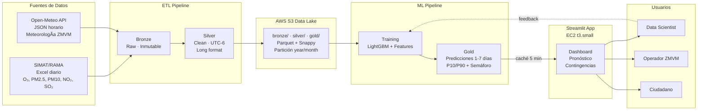

# AirSense MX — Arquitectura del Sistema

> Sistema de predicción de calidad del aire para la Zona Metropolitana del Valle de México (ZMVM). Predice contaminantes (O₃, PM2.5, PM10, NO₂, SO₂) con horizonte de 1-7 días usando datos históricos SIMAT y meteorología Open-Meteo.

---

## Diagrama Visual

Diagrama interactivo completo: [arquitectura.drawio](./arquitectura.drawio)
_(Abrir con VS Code + extensión "Draw.io Integration" o en [app.diagrams.net](https://app.diagrams.net))_

---

## Capas de la Arquitectura

| # | Capa | Qué hace | Tecnología |
|---|------|----------|------------|
| 1 | **Ingesta** | Descarga SIMAT (Excel) y Open-Meteo (JSON) diariamente a las 06:00 AM | Python · requests · openpyxl |
| 2 | **ETL Bronze → Silver** | Normaliza timestamps UTC-6, reemplaza -99→NULL, pivota wide→long, valida schemas | pandas · PyArrow · awswrangler |
| 3 | **S3 Data Lake** | Almacena Bronze/Silver/Gold en Parquet+Snappy con Hive partitioning (year/month) | AWS S3 · Athena · Glue |
| 4 | **ML Pipeline** | Entrena LightGBM con lags/rolling features; genera predicciones con incertidumbre P10/P90 | LightGBM · SHAP · joblib |
| 5 | **Streamlit App** | Dashboard, Pronóstico 7 días y Contingencias PCAA con explicaciones NLP via Bedrock | Streamlit · Plotly · boto3 |

---

## Fuentes de Datos

| Fuente | Formato | Cobertura | Notas |
|--------|---------|-----------|-------|
| **SIMAT/RAMA** | Excel anual (wide: FECHA/HORA/estaciones) | 2021–2026 | Valor faltante = -99; convertido a NULL en Silver |
| **Open-Meteo API** | JSON horario (hourly.*) | 5 centroides ZMVM | Temp, Presión, Humedad, Viento, Radiación solar |
| **dim_estaciones.csv** | CSV maestro versionado en Git | 5 zonas: NO/NE/SE/SO/CE | Master data para validación y denormalización |

---

## Stack Tecnológico

| Dominio | Herramienta | Versión / Notas |
|---------|-------------|-----------------|
| Lenguaje | Python | 3.11+ · uv package manager |
| Data | pandas, PyArrow, awswrangler | Parquet nativo, S3 directo |
| ML | LightGBM, SHAP, scikit-learn | Validación temporal, no aleatoria |
| App | Streamlit, Plotly | `@st.cache_data(ttl=300)` |
| NLP | Amazon Bedrock Claude Haiku | Fallback estático español |
| Infra | AWS S3, EC2, CloudFormation | IaC versionado en Git |
| Observabilidad | CloudWatch Logs | Logging estructurado centralizado |
| Calidad | Ruff (0 errores), pytest (53 tests, >85% cobertura) | CI en cada push |

---

## Decisiones de Diseño

| Decisión | Elegido | Descartado | Razón |
|----------|---------|------------|-------|
| Almacenamiento | **S3 + Parquet** | RDS PostgreSQL | Sin PII; datos analíticos; costo mínimo |
| Predicción | **Batch diario 06:00** | Real-time | Caso de uso ambiental; no requiere sub-minuto |
| Orquestación | **Cron / EventBridge** | Airflow / Prefect | Pipeline simple; overhead injustificado |
| Formato columnar | **Parquet + Snappy** | CSV | 10x compresión; nativo en Athena/DuckDB |
| NLP | **Bedrock fallback** | LLM propio | ~$0.25/M tokens; sin servidor; fallback estático |

---

## Seguridad

- **Mínimo privilegio:** IAM Role EC2 = solo lectura Gold S3 + Bedrock. Sin acceso a Bronze/Silver.
- **Sin credenciales en código:** AWS Secrets Manager para todas las keys.
- **Datos públicos:** SIMAT es open data; sin PII; sin datos sensibles.

---

## Referencias

- Diagrama visual: [docs/arquitectura.drawio](./arquitectura.drawio)
- Estándares de código: [.github/copilot-instructions.md](../.github/copilot-instructions.md)
- Data contracts: [docs/datasets/](./datasets/)
