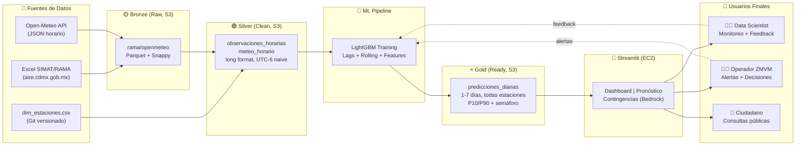
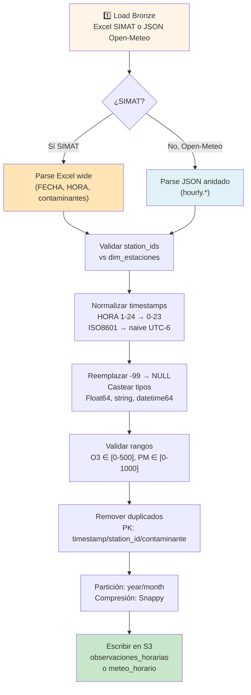
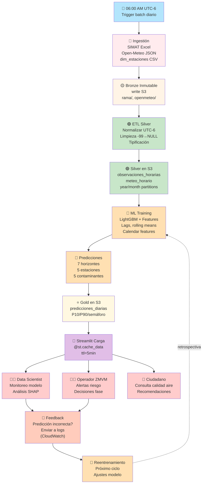
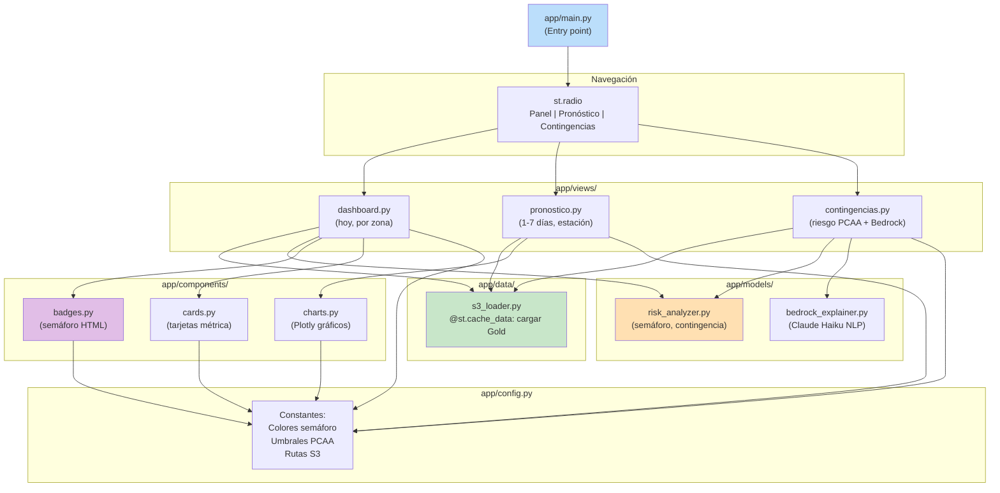

# Arquitectura y Decisiones Clave — AirSense MX

## Justificación de Arquitectura

### 1. Medallion Architecture (Bronze → Silver → Gold)

- **Ventaja:** Separación clara entre datos crudos, normalizados y listos para consumo. Permite auditoría, recuperación de errores y evolución del pipeline sin afectar a los consumidores finales.
- **Trade-off:** Mayor almacenamiento en S3, pero bajo costo y flexibilidad para retroactivos.
- **Escalabilidad:** Cada capa puede actualizarse independientemente. Bronze inmutable, Silver validado, Gold optimizado para Streamlit.

### 2. Batch Predictions (No Real-Time)

- **Ventaja:** Predicciones precomputadas = consultas rápidas en Streamlit, sin latencia de inferencia.
- **Trade-off:** Pronóstico se regenera una vez al día. Suficiente para el caso de uso (alerta ambiental, no trading).
- **Costo:** Infraestructura mínima. No hay servidores de predicción corriendo 24/7.

### 3. Separación de Capas

- **ETL (Bronze → Silver) desacoplado de ML (Gold):** Antonio entrega Silver; Gustavo entrega Gold. Sin dependencias bidireccionales.
- **App desacoplada de lógica de negocio:** Streamlit solo lee Gold. La lógica de riesgo, semáforo y explicaciones NLP vive en módulos independientes (`app/models/`).
- **Facilita:** Pruebas unitarias, CI/CD, reutilización de componentes, escalado independiente.

### 4. AWS como Plataforma

| Servicio | Rol | Justificación |
|---|---|---|
| **S3** | Data lake central (Bronze/Silver/Gold) | Bajo costo, durabilidad 11 nueves, particionado con Hive para Athena/Glue |
| **Glue Data Catalog** | Metadatos y descubrimiento | Integración nativa con S3 y Athena; gobierno de datos |
| **Athena** | Consultas SQL ad-hoc | Serverless, SQL estándar, compatible con Parquet particionado |
| **DuckDB (local/dev)** | Testing rápido sin AWS | Motor SQL compatible, ideal para debugging de ETLs |
| **Bedrock (Claude Haiku)** | Explicaciones NLP | Generación de texto en lenguaje natural; fallback estático si no disponible |
| **EC2 t3.small** | Streamlit + scheduler batch | Mínimo, suficiente para 100-500 usuarios concurrentes |
| **CloudFormation** | Infraestructura reproducible | IaC versionada en Git; auditable; fácil replicación a otros entornos |
| **Secrets Manager** | Credenciales AWS | Rotación automática, cumplimiento; nunca hardcodear en código |
| **CloudWatch** | Logging y alertas | Centralizado, búsqueda de logs, métricas de performance |

### 5. Fuentes de Datos Específicas

| Fuente | Formato | Frecuencia | Validación |
|---|---|---|---|
| **SIMAT/RAMA** | Excel (wide: FECHA/HORA/contaminantes por estación) | Diaria | -99 → NULL; rango [0-500 ppb/µg/m³] |
| **Open-Meteo** | JSON (hourly: arrays anidados) | Diaria (5 centroides ZMVM) | Rangos plausibles (temp -20 a +50°C, etc.) |
| **dim_estaciones** | CSV versionado en Git | Manual (ad-hoc cambios) | PK station_id, validación de zonas (NO/NE/SE/SO/CE) |

### 6. Logging y Observabilidad

- **Logging estructurado:** `logger.info(msg, extra={rows, station_id, error})` → compatible con CloudWatch.
- **Niveles:** DEBUG (interno), INFO (hitos), WARNING (degradación recuperable), ERROR (reintento), CRITICAL (fallo irrecuperable).
- **Métricas:** Conteos de ETL (input/output/validación), latencias de predicción, hit rates de caché Streamlit.
- **Feedback:** Usuarios reportan predicciones incorrectas → loop de mejora para Gustavo.

### 7. Seguridad y Operación

- **Principio de mínimo privilegio:** IAM role para EC2 = solo lectura de Gold en S3 + acceso a Bedrock. No acceso a Bronze/Silver.
- **Secrets fuera del código:** AWS Secrets Manager para credenciales AWS, API keys (si aplica).
- **Cumplimiento:** Datos públicos (SIMAT es abierto); sin PII; sin datos sensibles.
- **Disaster recovery:** Datos en S3 replicados automáticamente; versioning habilitado.

---

## Fuentes de Datos Detalladas

### 1. SIMAT/RAMA (Red Automatizada de Monitoreo Atmosférico)

**Descripción:**
- Red de monitoreo atmosférico de la Ciudad de México y área metropolitana (ZMVM).
- Proporciona contaminantes horarios desde 2015: **O₃, PM2.5, PM10, NO₂, SO₂**.
- Datos **públicos**, descargables manualmente por año/contaminante en Excel.

**Estructura del archivo Excel (formato wide):**
```
FECHA    HORA    NO_CE    NE_CE    SE_CE    SO_CE    CE_CE    ... (5 zonas × 5 contaminantes)
2024-01-01  1     45.2    38.1    52.3    -99     41.0
2024-01-01  2     48.1    40.2    -99     39.5    43.1
```
- **Columnas:** FECHA (YYYY-MM-DD), HORA (1-24), luego cada estación/zona con contaminante
- **Valores especiales:** `-99` = falta (reemplazado a NULL en Silver)
- **Rango válido:** 0-500 ppb para O₃/NO₂, 0-1000 µg/m³ para PM

**Acceso:**
- Sitio oficial: http://www.aire.cdmx.gob.mx/ → Descargas
- Formato: Excel anual (AAAA_Contaminante.xls)
- Actualización: Diaria (datos del día anterior disponibles)

**Ingestión Bronze:**
```
s3://itam-analytics-antonio/air-sense-mx/bronze/
  rama/
    O3/
      2021.xls
      2022.xls
      ...
    PM25/
      2021.xls
      ...
```

**Transformación Silver:**
- Despivotar wide → long (por hora, estación, contaminante)
- Normalizar HORA: 1-24 → 0-23
- Reemplazar -99 → NULL
- Generar `datetime_local` (naive, UTC-6)
- Particionar por year/month en Parquet

---

### 2. Open-Meteo (API de Meteorología Abierta)

**Descripción:**
- Proveedor gratuito de datos meteorológicos históricos y pronósticos.
- Variables: Temperatura, presión, humedad, precipitación, viento, radiación solar.
- Interfaz: API JSON REST
- Sin autenticación requerida
- Resolución: Horaria, con histórico desde 1940

**Estructura del response JSON:**
```json
{
  "latitude": 19.4326,
  "longitude": -99.1332,
  "timezone": "America/Mexico_City",
  "hourly": {
    "time": ["2024-01-01T00:00", "2024-01-01T01:00", ...],
    "temperature_2m": [15.2, 14.8, ...],
    "relative_humidity_2m": [72, 75, ...],
    "pressure_msl": [1013.25, 1013.10, ...],
    "precipitation": [0.0, 0.1, ...],
    "wind_speed_10m": [3.5, 4.2, ...],
    "shortwave_radiation": [0, 5.2, ...]
  }
}
```

**Variables meteorológicas capturadas:**
| Variable | Unidad | Rango Típico | Uso |
|---|---|---|---|
| `temperature_2m` | °C | -20 a +50 | Correlación térmica con O₃ |
| `relative_humidity_2m` | % | 0-100 | Humedad relativa |
| `pressure_msl` | hPa | 900-1050 | Presión a nivel del mar |
| `precipitation` | mm | 0-50 | Precipitación acumulada hora |
| `wind_speed_10m` | m/s | 0-15 | Velocidad viento (dispersión) |
| `shortwave_radiation` | W/m² | 0-1000 | Radiación solar → fotoquímica O₃ |

**Acceso:**
- Endpoint: `https://archive-api.open-meteo.com/v1/archive`
- Parámetros:
  ```
  ?latitude=19.4326
  &longitude=-99.1332
  &start_date=2021-01-01
  &end_date=2026-05-22
  &hourly=temperature_2m,relative_humidity_2m,pressure_msl,precipitation,wind_speed_10m,shortwave_radiation
  &timezone=America/Mexico_City
  ```
- **Rate limit:** No limitado (gratis)
- **Actualización:** Histórico estable; pronóstico se actualiza cada 6 horas

**Centroides ZMVM (5 estaciones):**
| Zona | Latitud | Longitud | Estación |
|---|---|---|---|
| Centro | 19.4326 | -99.1332 | CDMX Centro |
| Noroeste | 19.5200 | -99.2800 | Tlalnepantla |
| Noreste | 19.5700 | -98.9900 | Ecatepec |
| Sureste | 19.3200 | -98.9800 | Chalco |
| Suroeste | 19.2800 | -99.2300 | Xochimilco |

**Ingestión Bronze:**
```
s3://itam-analytics-antonio/air-sense-mx/bronze/
  openmeteo/
    CE/
      2021.json
      2022.json
      ...
    NO/
      2021.json
      ...
```

**Transformación Silver:**
- Desanidación: hourly.* → columnas individuales
- Normalización temporal: ISO8601 → naive datetime64[ns] (UTC-6)
- Casteo tipos: Float64 para métricos
- Enriquecimiento: Denormalizar lat/lon por estación
- Particionar por year/month en Parquet

---

### 3. Fuentes Auxiliares

**dim_estaciones.csv** (versionado en Git)
```csv
station_id,zone,station_name,latitude,longitude,altitude_m,source
NO_CE,NO,Centro Noroeste,19.52,-99.28,2250,simat
NE_CE,NE,Centro Noreste,19.57,-98.99,2200,simat
...
```
- **Propósito:** Master data para validación y denormalización
- **Update:** Manual (ad-hoc cambios de estaciones)
- **Ubicación:** `data/raw/dim_estaciones.csv`

---

## Pipeline de Ingesta Diaria

```bash
# 06:00 AM UTC-6 (triggered por cron/EventBridge)

# 1. Descargar SIMAT manualmente (hoy - 1 día) → Bronze
# 2. Descargar Open-Meteo API → Bronze

# 3. Ejecutar ETL Silver
uv run python -m etl.silver rama --year 2026 --month 5

uv run python -m etl.silver openmeteo --year 2026 --month 5

# 4. Validar calidad
# - Duplicados = 0
# - Nulls < 5%
# - Timestamps todos válidos

# 5. Ejecutar training (Gustavo)
# python -m training predict --date 2026-05-22

# 6. Escribir Gold + caché Streamlit
# @st.cache_data(ttl=300)
```

---

## Diagrama de Arquitectura

> **📊 Diagrama Visual (draw.io):** Consulta [arquitectura.drawio](./arquitectura.drawio) para vista interactiva completa. Abre con [draw.io](https://app.diagrams.net/?src=about#Hdocs/arquitectura.drawio) o directamente en VS Code con la extensión Draw.io Integration.

### 0. Arquitectura Simplificada por Capas (draw.io)

El diagrama [arquitectura.drawio](./arquitectura.drawio) organiza el sistema en **5 capas horizontales**:

| Capa | Descripción | Componentes |
|------|-------------|-------------|
| **1. Ingesta de Datos** | Fuentes externas + trigger | SIMAT/RAMA (Excel), Open-Meteo (JSON), dim_estaciones (CSV), Trigger 06:00 AM |
| **2. ETL Pipeline** | Transformación local | Bronze (raw, inmutable), Silver (clean, UTC-6 naive), Validaciones, Particiones year/month |
| **3. Data Lake + ML** | Almacenamiento + predicciones | AWS S3 (bronze/silver/gold), LightGBM Training, Gold (P10/P90/Semáforo) |
| **4. Streamlit App** | Frontend EC2 t3.small | Dashboard, Pronóstico 7 días, Contingencias + Bedrock NLP |
| **5. AWS Services + Usuarios** | Infraestructura + stakeholders | Bedrock, CloudWatch, Secrets Manager, CloudFormation + 3 perfiles de usuario |

**Flujo principal:** `SIMAT/Open-Meteo → Bronze → Silver → S3 → ML → Gold → Streamlit → Usuarios → Feedback Loop`

### 1. Visión General: Datos → Predicciones → Usuarios



---

### 2. Flujo de ETL (Bronze → Silver)



---

### 3. Flujo de Predicción Batch (Silver → Gold)

```mermaid
graph TD
    A["1️⃣ Read Silver<br/>observaciones_horarias + meteo_horario"]
    B["2️⃣ Feature Engineering<br/>Lags (1, 3, 7 días)<br/>Rolling means (7, 30 días)<br/>Calendar features"]
    C["3️⃣ Split Temporal<br/>Train = [2015-2024]<br/>Valid = cuantil 80%"]
    D["4️⃣ Train LightGBM<br/>Targets: o3_max_1h, pm25_avg_24h, pm10_avg_24h"]
    E["5️⃣ Validar Baseline<br/>Modelo vs naive<br/>(último valor)]
    F["6️⃣ Generar Predicciones<br/>Horizonte 1-7 días<br/>Todas las estaciones<br/>Todos los contaminantes"]
    G["7️⃣ Calcular Incertidumbre<br/>Percentiles P10/P90<br/>+ Probabilidad contingencia"]
    H["8️⃣ Derivar Semáforo<br/>Verde/Amarillo/Naranja/Rojo<br/>según umbrales PCAA"]
    I["9️⃣ Escribir Gold<br/>predicciones_diarias<br/>year=YYYY/month=MM"]

    A --> B
    B --> C
    C --> D
    D --> E
    E --> F
    F --> G
    G --> H
    H --> I

    style A fill:#C8E6C9
    style I fill:#FFCCBC
```

---

### 4. Ciclo Completo: Ingestión → Predicción → Usuarios → Feedback



---

## Usuarios Finales y Casos de Uso

### 1. 👨‍🔬 Data Scientist / ML Engineer

**Rol:** Monitoreo del modelo, análisis de predicciones, retroalimentación para reentrenamiento.

**Acceso a:**
- Streamlit Dashboard (observación de predicciones en vivo)
- CloudWatch logs (desempeño ETL, ML metrics)
- Gold layer en S3 (análisis SHAP, feature importance)
- Jupyter notebooks (experimentación local)

**Feedback loop:** Reporta predicciones incorrectas → entra en logs → Gustavo toma para reentrenamiento.

---

### 2. 👨‍💼 Operador / Gestor ZMVM

**Rol:** Decisiones operacionales, emisión de alertas, gestión de contingencias.

**Acceso a:**
- Streamlit página **Contingencias** (semáforo + probabilidad PCAA)
- Explicación Bedrock ("¿Por qué riesgo alto hoy?") 
- Dashboard histórico (análisis tendencias)
- Alertas automáticas (SMS/email si prob_contingencia > 70%)

**Acciones:** Emite "Fase 0 → Fase 1" de contingencia ambiental.

---

### 3. 📱 Ciudadano / Usuario Público

**Rol:** Consultas de calidad del aire, recomendaciones personales.

**Acceso a:**
- Streamlit página **Dashboard** (semáforo actual)
- Streamlit página **Pronóstico** (predicción 7 días)
- App móvil (futura integración)

**Casos de uso:**
- "¿Puedo salir a correr hoy?" → Consulta Dashboard
- "¿Aire mañana?" → Consulta Pronóstico
- Push notifications si semáforo cambia a rojo

---

## Arquitectura de la App Streamlit



---

## Decisiones de Diseño Clave

### ❌ Qué NO usamos (y por qué)

| Rechazado | Razón | Alternativa Elegida |
|---|---|---|
| **RDS PostgreSQL** | Complejidad innecesaria; Gold ya es estructura tabular en S3 | S3 + Athena (queries ad-hoc) |
| **Real-time predictions** | Costo alto; caso de uso no lo requiere | Batch diario a las 06:00 AM |
| **Airflow/Prefect** | Overhead para pipeline simple | Cron + bash scripts (o EventBridge) |
| **Data warehouse (Snowflake)** | Costo; datos no son ultra-densos | S3 + Athena (suficiente) |
| **Logs a ELK/Splunk** | Costo; CloudWatch es nativo AWS | CloudWatch Logs + CloudWatch Insights |

### ✅ Qué SÍ usamos (y por qué)

| Elegido | Ventaja | Trade-off |
|---|---|---|
| **Parquet + Snappy** | Compresión 10x; compatible PyArrow/DuckDB/Athena | No es CSV (requiere tooling) |
| **Hive partitioning** | Optimiza queries Athena; parallelismo | Requiere estructura estricta |
| **Streamlit** | Prototipado rápido; sin HTML/CSS custom | Menos flexible que React, pero suficiente |
| **Bedrock Claude Haiku** | Costo bajo (~$0.25 por 1M tokens input); fallback estático | Latencia ~2-3s; optional para MVP |
| **GitHub + Actions** | Control de versión + CI/CD simple | Learning curve mínima |

---

## Escalabilidad Futura

- **+1000 estaciones:** Particionar por región geográfica; Multi-región S3.
- **Real-time:** Agregar Amazon SageMaker real-time endpoint; caché con Redis.
- **Retroactivos:** Volver a entrenar con datos históricos nuevos; re-predicción batch.
- **Gobierno:** Glue Data Quality checks; Data Lineage con Apache Atlas.

---

- **Estándares Python:** [.github/copilot-instructions.md](../../.github/copilot-instructions.md)
- **Runbooks operacionales:** [docs/runbooks/](./runbooks/) (TBD)
